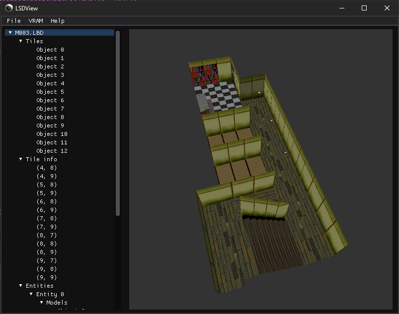

# LSDView
Data file viewer for LSD Dream Emulator.

## User guide
LSDView can load and view many files from PlayStation 1 game 'LSD: Dream Emulator'

### Formats
Currently supported file formats are:
- TMD (PlayStation models)
    - Can export to OBJ
- TIM (PlayStation textures)
    - Can export to PNG
- TIX (Archives of TIM files, used to load collections of textures into VRAM)
    - Can export all to PNG
- LBD (Sections of levels in LSD, also contains models in level with animations)
- MOM (Containers for 3D meshes and their animations)

### Controls
- The 3D view can be rotated (in an Arcball fashion) by clicking and dragging
- Scroll wheel can be used to zoom in and out
- Click and drag with the right mouse button to pan around
- If you want to recenter the view, there's a button for this in the help menu.

### Textures
When you view a 3D model from a level (STG00 to STG13) initially it will be untextured. 
To texture it, you need to load textures into VRAM. To do this, click on the VRAM menu,
then 'Load VRAM', and choose a TIX file from the level. Each TIX file is a different
texture set.

If you load a TIX file from a different level you can emulate the glitch texture set.
Try it out!

## Development guide
1. Clone the repo
2. Run a NuGet restore
3. You're good to go
