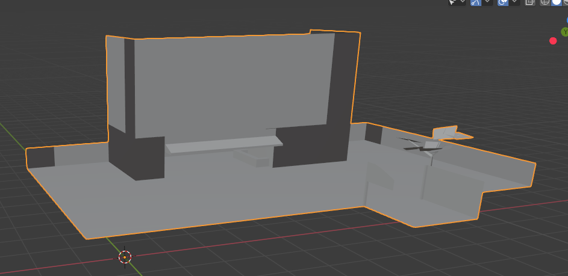
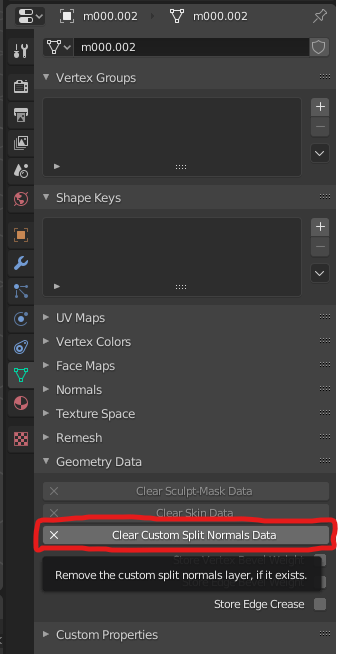
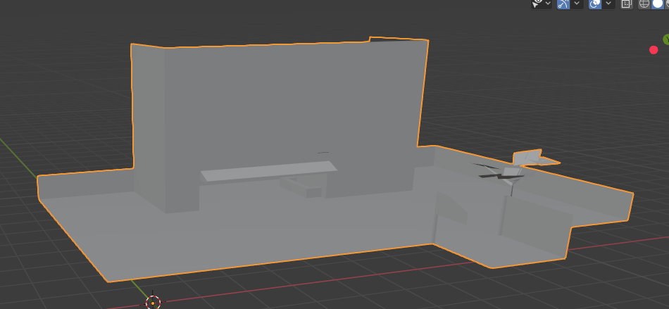

# LSDView

Data file viewer for LSD Dream Emulator.

## Features

- View/export 3D models
- View/export levels
- View animations
- View/export textures
- Export 3D models as OBJ or PLY
- Export textures as PNG
- Headless mode for converting entire dreams

## User guide

LSDView can load and view many files from PlayStation 1 game 'LSD: Dream Emulator'

### On the first launch

When you first run LSDView you should set the path to where your LSD data is. You will be given a dialog prompting you
to do this on your first launch of the program.

### Formats

Currently supported file formats are:

- TMD (PlayStation models)
    - Can export to OBJ and PLY
- TIM (PlayStation textures)
    - Can export to PNG
- TIX (Archives of TIM files, used to load collections of textures into VRAM)
    - Can export all to PNG
- LBD (Sections of levels in LSD, also contains models in level with animations)
    - Can export to OBJ and PLY
- MOM (Containers for 3D meshes and their animations)
    - Can export models to OBJ and PLY, not animations

### Controls

- The 3D view can be rotated (in an Arcball fashion) by clicking and dragging
- Scroll wheel can be used to zoom in and out
- Click and drag with the right mouse button to pan around
- If you want to recenter the view, there's a button for this in the help menu.

### Textures

When you view a 3D model from a level (STG00 to STG13) initially it will be untextured. To texture it, you need to load
textures into VRAM. To do this, click on the VRAM menu, then 'Load VRAM', and choose a TIX file from the level. Each TIX
file is a different texture set.

If you load a TIX file from a different level you can emulate the glitch texture set. Try it out!

### Headless mode

If you run LSDView in a terminal with command-line arguments, you can use it 'headless' (i.e. without a graphical
frontend) mode. This is where CPU-intensive tasks can be performed. At the moment there is just one
command, `exportdream`, which can export an entire dream.

Try it out by opening a terminal and running `LSDView.exe exportdream --help`!

### Exporting models

You can export 3D models from LSDView to OBJ and PLY formats. This includes the LBD level tiles themselves. These
exported models contain UVs into a combined texture atlas for the entire level.

It's recommended to export to PLY as opposed to OBJ, as the PLY format supports vertex colour data (OBJ does not).

This texture atlas can be exported from the 'VRAM' menu after loading VRAM. Simply click on the 'VRAM' menu, then
click 'Export VRAM...'. If you use this exported image as the texture for any OBJ files exported from LSDView, then the
textures should be applied correctly. There may be some errors for polygons that use vertex colouring as the OBJ file
format does not support storage of vertex colour information.

#### OBJ export shading issue (Blender)

If you export as OBJ and you get shading errors that look like this:

Then you can fix this in Blender by pressing this button under 'Object data properties' (with the object selected):

And the shading should now look normal:

## Development guide

1. Clone the repo
2. Run a NuGet restore
3. You're good to go

Make sure to follow the standard C# coding conventions
seen [here.](https://docs.microsoft.com/en-us/dotnet/csharp/programming-guide/inside-a-program/coding-conventions)
Additionally, Line lengths must not exceed 120 characters in length.
